<!--
  Observatory-themed profile README.
  - Static SVGs in ./assets come from scripts/generate_assets.py (edit text at the top, re-run).
  - ./dist is rebuilt daily from live GitHub data by .github/workflows/profile-3d.yml.
  - All text is drawn with the 14-segment display font in scripts/segfont.py.
-->

  
  

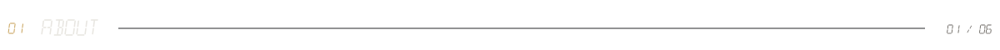

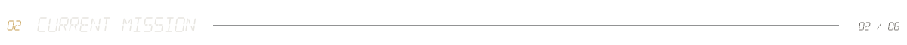
<a href="https://github.com/Abhinav9897S/sudarshana-vyuha-website" title="Sudarshana Vyuha">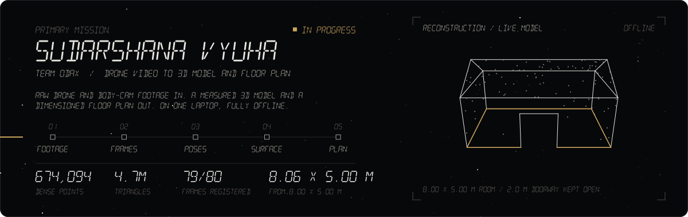</a>

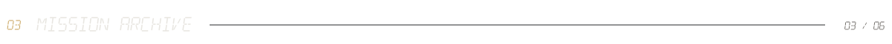

  <a href="https://github.com/Abhinav9897S/DueDiligenceIQ" title="DueDiligenceIQ">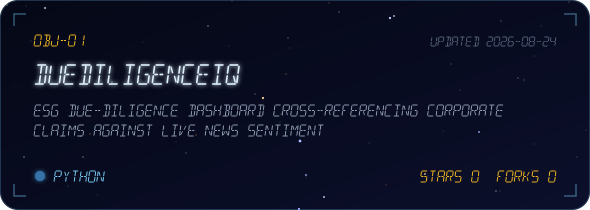</a>
  <a href="https://github.com/Abhinav9897S/forex-trade-optimizer" title="forex-trade-optimizer">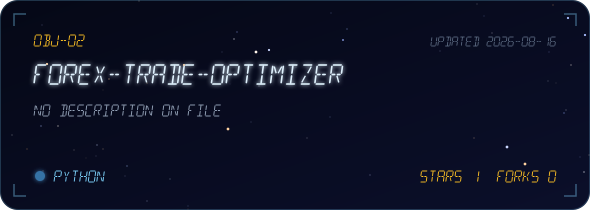</a>
  <a href="https://github.com/Abhinav9897S/AQI-Predictor" title="AQI-Predictor">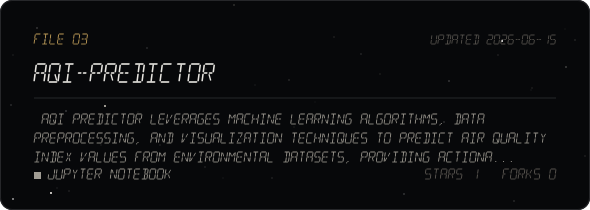</a>
  <a href="https://github.com/Abhinav9897S/Working-with-IBM-Granite" title="Working-with-IBM-Granite">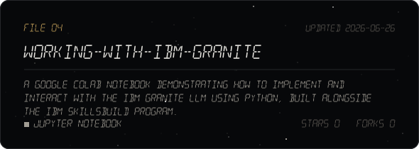</a>

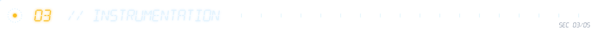

  
  
  
  
  
  
  
  
  
  
  
  
   
  
  
  
  
  
  
  
  
  
  
  
  

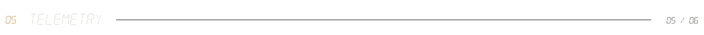

  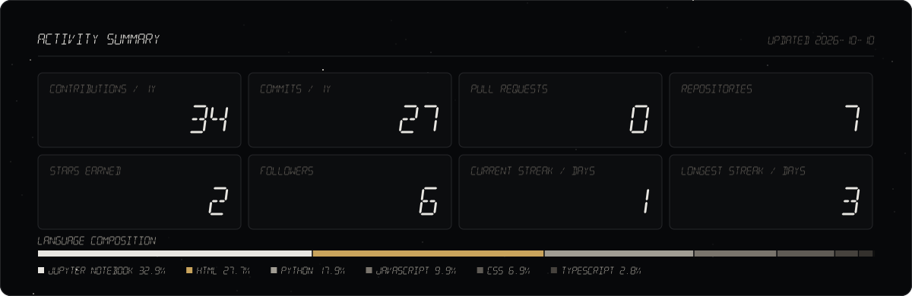
  
  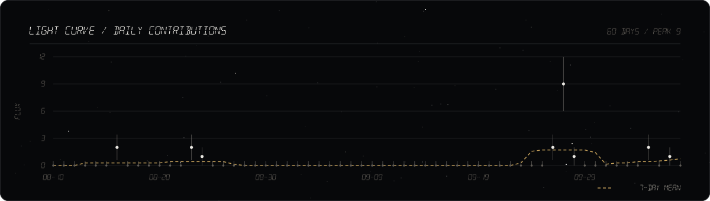

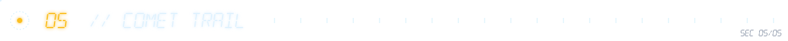

  

 

