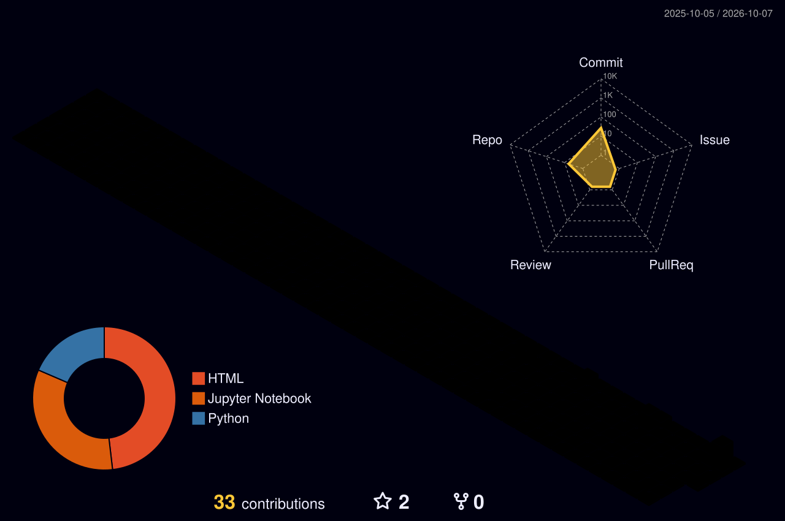

<!--
  ✨ Premium 3D profile README
  - Animated SVGs live in ./assets and are generated by scripts/generate_assets.py
    (edit NAME / TAGLINE at the top of that script, then re-run it).
  - The 3D contribution skyline + contribution snake are generated daily by
    .github/workflows/profile-3d.yml. Run it once from the Actions tab to populate them.
-->

<div align="center">



<a href="https://git.io/typing-svg">
  
</a>

<p>
  
  <a href="https://github.com/Abhinav9897S?tab=followers"></a>
  <a href="https://github.com/Abhinav9897S?tab=repositories"></a>
</p>

</div>



## 🪐 About Me



```python
class Abhinav:
    name     = "Abhinav Singh"
    studying = "Mathematics & Computing @ JIIT (2029)"
    based_in = "Noida, Uttar Pradesh, India"
    interests = ["AI", "Machine Learning", "Data Science",
                 "Information Retrieval", "Astrophysics", "Open Source"]
    fun_fact = "the banner above is real 3D math baked into SVG ✨"
```

- 🎓 Studying **Mathematics & Computing** at **JIIT** (Class of 2029)
- 🤖 Into **AI, ML & Data Science**: building models that actually ship
- 🔍 Exploring **Information Retrieval** and search systems
- 🔭 Looking up at the sky: **Astrophysics** enthusiast
- 🌱 Open-source contributor, always learning
- 💼 Open to internships & collaborations

<br clear="right" />


## 🚀 Featured Projects

<div align="center">

<a href="https://github.com/Abhinav9897S/DueDiligenceIQ"></a>
<a href="https://github.com/Abhinav9897S/forex-trade-optimizer"></a>
<a href="https://github.com/Abhinav9897S/AQI-Predictor"></a>
<a href="https://github.com/Abhinav9897S/Working-with-IBM-Granite"></a>

</div>


## ⚡ Tech Stack

<div align="center">


<br/><br/>


</div>


## 📊 GitHub Universe

<div align="center">



<br/>




</div>


## 🐍 Contribution Snake

<div align="center">

<picture>
  <source media="(prefers-color-scheme: dark)" srcset="./dist/github-snake-dark.svg" />
  <source media="(prefers-color-scheme: light)" srcset="./dist/github-snake.svg" />
  
</picture>

</div>

<br/>

<div align="center">
  
</div>
